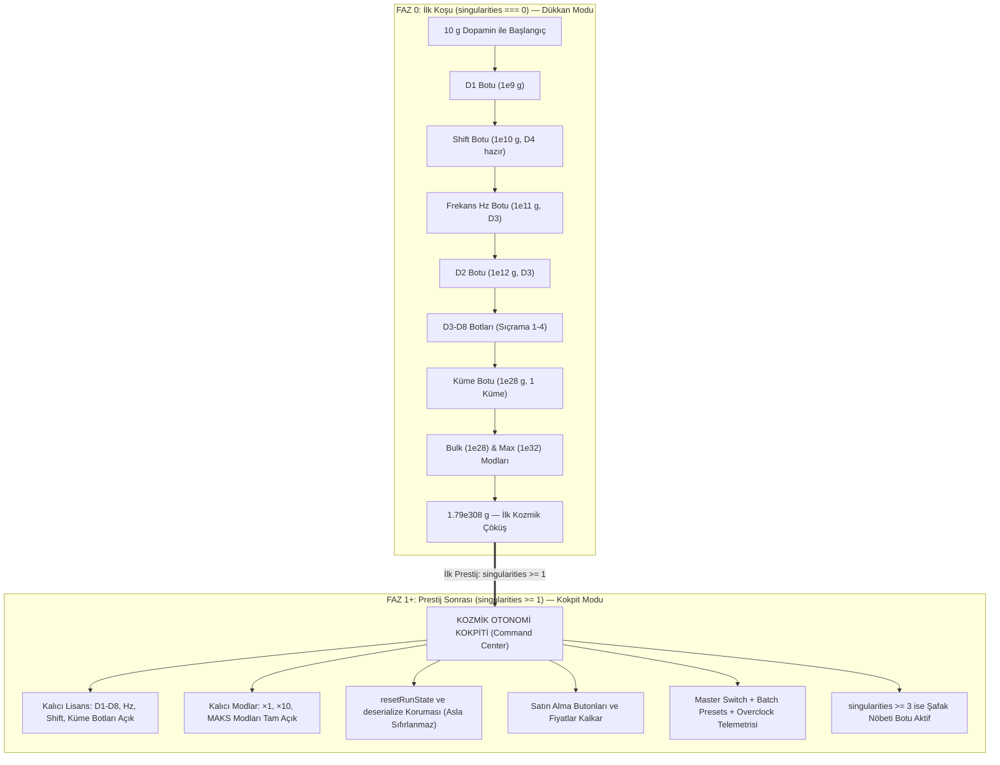

# UROBOROS: Botların Hibrit Yaşam Döngüsü ve Kozmik Otonomi Kokpiti Planı (Autobuyers & Cockpit Architecture)

**Belge Kodu:** PLAN-AUTOBUYERS-COCKPIT-01  
**Tarih:** 2026-10-06  
**Yazar:** Otonomi ve Bot Kokpiti Mimarı (Autobuyer & Cockpit Planner)  
**Hedef Kapsam:** `src/stores/game.ts`, `src/components/AutobuyersTab.vue`, `src/game/unlocks.ts`, `src/models/types.ts`, `src/App.vue`  
**Referans Dokümanlar:** `ADR-0009`, `ADR-0032`, `ADR-0035`, `brain/research/ouroboros-phase0-mathematical-architecture-and-pacing.md`

---

## 1. YÖNETİCİ ÖZETİ VE HİBRİT OTOMASYON FELSEFESİ

İnkremental ve idle oyun tasarımında otomasyon sistemleri (Autobuyers), oyuncunun oyunla kurduğu ilişkinin en kritik eşiğidir (*Antimatter Dimensions*, *Synergism*, *Exponential Idle*):
- **İlk Koşuda (Faz 0: $0 \to 1.79\times 10^{308}\text{ g}$):** Otomasyon bir "ödül merdiveni"dir. Oyuncunun her boyutu manuel yönettiği, kütle parası biriktirerek tek tek bot lisansı satın aldığı, ilk sıçramaları ve kümeleri sabırla inşa ettiği kutsal öğrenme ve keşif evresidir. Burada botlar tek tek, yavaş hızda (tekli mod, 8–20 sn tetiklenme) açılır.
- **İlk Prestijden Sonra ($\text{singularities} \ge 1$):** Oyunun doğası radikal bir şekilde değişir. Oyuncu evreni çökertmiş, kozmik gerçeği görmüş ve Tekillik Puanı (SP) kazanmıştır. Artık ikinci koşunun 15-20 dakika, üçüncü koşunun 2 dakika, ilerleyen koşuların saniyeler sürmesi hedeflenmektedir (Bkz: `ouroboros-phase0-mathematical-architecture-and-pacing.md` Tavsiye 4).
- **Temel Problem:** Mevcut kod yapısında ve `AutobuyersTab.vue` arayüzünde botlar prestij sonrasında da sanki bir "bakkal dükkanı"ndaymış gibi kütle parası ve kilit butonları göstermeye devam etmekte; oyuncunun her sıçramada veya prestijde aynı botları kütleyle satın alması gerekmekte veya kilitli buton karmaşası yaşanmaktadır.
- **Hibrit Yaşam Döngüsü Çözümü:**
  1. **Faz 0:** Botlar kademeli kütle parası ve sıçrama şartlarıyla sırayla açılır (D1 $\to$ Shift $\to$ Hz $\to$ D2 $\to$ D3-D8 $\to$ Galaxy).
  2. **Prestij Sonrası ($\text{singularities} \ge 1$):** Bir kez açılmış botlar **ASLA SIFIRLANMAZ**. Temel 11 bot (D1-D8, Frekans Hz, Akış Sıçraması, Akış Kümeleri) ile Bulk (×10) ve Max modları kalıcı olarak kilitsiz hale gelir (`resetRunState` ve `deserialize` kancalarıyla mutlak koruma).
  3. **Arayüz Dönüşümü:** `AutobuyersTab.vue` prestij sonrasında "Kütleyle Satın Al" kilitlerini ve fiyat butonlarını tamamen çöpe atar; sekme doğrudan fütüristik bir **"Kozmik Otonomi Kokpiti (Command Center)"** haline gelir (Merkezi Master Switch, Tek Dokunuşla Tümünü MAKS Yapma, Filo Overclock Telemetrisi, Şafak Nöbeti Marjinal Eğim Optimizatörü ve Bireysel Hızlı Şalterler).



---

## 2. MEVCUT KOD ANALİZİ & AÇIKLARIN TESPİTİ (CURRENT STATE AUDIT)

### 2.1. `src/stores/game.ts` Mevcut Durumu
1. **State Tanımı (Satır 1279-1295):**
   - Botlar varsayılan olarak `enabled: false, unlocked: false, mode: 'single'` olarak başlar.
   - `autobuyerBulkUnlocked: false` ve `autobuyerMaxUnlocked: false` alanları mevcuttur.
2. **`resetRunState()` Eksiği (Satır 3315-3370):**
   - `resetRunState()` fonksiyonu `matter`, `dimensions`, `tickspeedBought`, `dimensionShifts`, `galaxies` alanlarını sıfırlamaktadır.
   - Şu an botların `unlocked` alanını doğrudan sıfırlamasa da, `singularities >= 1` durumunda botların ve modların kalıcılığını garanti eden açık bir kanca (affirmative assertion / fallback protection) yoktur. Eğer oyuncu Faz 0'da D7/D8 botunu açamadan prestij yaptıysa, prestij sonrasında düşük kütle ile başladığında bu botları satın alma ekranı aramaktadır.
3. **`deserialize()` Eksiği (Satır 5218-5250):**
   - Kayıt yüklendiğinde `data.autobuyers` yüklenmektedir. Ancak eski kayıtlarda veya eksik kayıtlarda `data.singularities >= 1` olmasına rağmen botlar `unlocked: false` kalabilmekte; oyuncu prestijli olmasına rağmen Faz 0 dükkanına geri düşebilmektedir.
4. **Maliyet ve İlerleme Şartları (Satır 862-893 & 2342-2353):**
   - `isAutobuyerRequirementMet(id)` metodu boyut varlığını (`needTier`), sıçrama sayısını (`shifts`) ve küme sayısını (`galaxies`) kontrol eder.
   - Prestij sonrası bir koşu yeni başladığında `dimensionShifts = 0`, `galaxies = 0` olur. Eğer bir bot kilitli kaldıysa, prestij sonrası koşuda bile 4 sıçrama yapana kadar o botu satın alamaz! Bu durum, hızlı prestij koşularını (speedruns) felç eder.
5. **Bildirim Noktası Çelişkisi (`hasAffordableLockedBot` - Satır 1740-1747):**
   - `hasAffordableLockedBot` getter'ı, parası yeten kilitli bot varsa sekmede mavi nokta (`hasBotAlert`) yakar.
   - Prestij sonrasında dükkan kavramı kalktığında bu getter gereksiz yere çalışmamalıdır.

### 2.2. `src/game/unlocks.ts` & Sekme Senkronu
- `FEATURE_UNLOCKS` içinde (Satır 234):
  ```ts
  {
    id: 'autobuyers',
    name: 'Otomatik Botlar Sekmesi',
    hint: '1e12 Dopamin biriktir',
    req: { kind: 'dopamine', amount: decadeGate(12) },
    order: 120
  }
  ```
- **Zamanlama Tutarsızlığı:** D1 botu `1e9` kütle, Shift botu `1e10` kütle, Frekans Hz botu `1e11` kütle olarak tanımlanmıştır (ADR-0032). Ancak sekmenin kendisi `1e12`'de (`decadeGate(12)`) açılmaktadır.
- Bu durum, oyuncunun 1e9 - 1e11 arasında bot satın alabilecek güce sahip olmasına rağmen sekmeyi görememesine yol açar.
- **Çözüm:** `autobuyers` sekmesinin açılış kapısı `decadeGate(9)` ($10^9 = 1\text{ Milyar Dopamin}$) olarak ayarlanmalı veya merdiven bu doğrultuda hizalanmalıdır. Prestij sonrası ise sekme `lifetimePeakMatter >= 1.79e308` sayesinde zaten kalıcı olarak açık kalır.

### 2.3. `src/components/AutobuyersTab.vue` Mevcut Arayüz Eksikleri
- Bileşen tüm durumlarda aynı statik dükkan şablonunu kullanmaktadır:
  - Üstte sabit kademe kartları ("×10 Modu Aç", "Maks Modu Aç" satın alma butonları).
  - Kartların altında kilitliyse büyük "Botu Satın Al (X g Kütle)" butonu.
- Prestijli bir oyuncunun bu butonları görmesi anlamsızdır ve bilişsel kirlilik (UI slop) yaratır.
- Prestij sonrası kullanıcıya gereken: Tek bakışta tüm filoyu yönetmek, tek tıkla tüm filoyu MAKS moda almak, hız çarpanını görmek ve kuralları ayarlamaktır.

---

## 3. BOTLARIN HİBRİT YAŞAM DÖNGÜSÜ MİMARİSİ

### 3.1. Faz 0 (İlk Koşu - `singularities === 0`): Kademeli Dükkan Akışı

Faz 0'da botlar inkremental bir pacing ile sırayla açılır:

| Sıra | Bot Adı / ID | Kütle Maliyeti | İlerleme Şartı | Mod & Tetiklenme Hızı | Tasarım Amacı & Pacing Rolü |
| :---: | :--- | :--- | :--- | :--- | :--- |
| **0** | **Botlar Sekmesi** | — | $10^9\text{ Dopamin}$ (`decadeGate(9)`) | — | Oyuncu ilk kez otomasyon fabrikası ile tanışır. |
| **1** | **D1: Kedi Videoları** | $10^9\text{ g}$ ($1\text{ Milyar}$) | Yok | $\times 1$ Tekli (8.0 sn) | İlk tat; oyuncunun parmak yorgunluğunu hafifletir. |
| **2** | **Akış Sıçraması (Shift)** | $10^{10}\text{ g}$ | $0\text{ Sıçrama}$ (D4 hazır) | $\times 1$ Tekli (15.0 sn) | D4 açıldığında ilk sıçramayı otonomlaştırır (Idle kurtarıcı). |
| **3** | **Frekans (Hz / Tickspeed)** | $10^{11}\text{ g}$ | D3 Sahibi Ol | $\times 1$ Tekli (10.0 sn) | Üstel kaskad hızlandırıcısını devreye sokar. |
| **4** | **D2: Sokak Lezzetleri** | $10^{12}\text{ g}$ | D3 Sahibi Ol | $\times 1$ Tekli (8.0 sn) | İkinci katman besleyicisi. |
| **5** | **D3: ASMR Sabun** | $10^{15}\text{ g}$ | $1\text{ Sıçrama}$ | $\times 1$ Tekli (8.0 sn) | Sıçrama sonrası kaskad zincirini otomatikleştirir. |
| **6** | **D4: Subway Surfers** | $10^{18}\text{ g}$ | $1\text{ Sıçrama}$ | $\times 1$ Tekli (8.0 sn) | 4. boyut otomatik beslemesi. |
| **7** | **D5: Sigma Girişimci** | $10^{22}\text{ g}$ | $1\text{ Sıçrama}$ | $\times 1$ Tekli (8.0 sn) | Planck yırtılması sonrası 5. boyut üretimi. |
| **8** | **D6: Hint Dizisi** | $10^{26}\text{ g}$ | $2\text{ Sıçrama}$ | $\times 1$ Tekli (8.0 sn) | Üst katman kaskadı. |
| **9** | **Akış Kümeleri (Galaxy)** | $10^{28}\text{ g}$ | $1\text{ Küme}$ | $\times 1$ Tekli (20.0 sn) | İlk galaksi sonrası galaksileri otomatik toplar. |
| **10** | **Toplu Alım Kademesi (Bulk)** | $10^{28}\text{ g}$ | $1\text{ Sıçrama}$ | Global $\times 10$ Yetkisi | Botların 10'lu paket almasını sağlar (1.5 - 4.0 sn). |
| **11** | **D7: Kriz Belgeseli** | $10^{30}\text{ g}$ | $3\text{ Sıçrama}$ | $\times 1$ Tekli (8.0 sn) | Yıldızlar ölçeği otomasyonu. |
| **12** | **Maks Alım Kademesi (Max)** | $10^{32}\text{ g}$ | $1\text{ Küme}$ | Global MAKS Yetkisi | Botların paran yettiği kadar almasını sağlar (0.5 - 2.0 sn). |
| **13** | **D8: Beyin Çürümesi** | $10^{35}\text{ g}$ | $4\text{ Sıçrama}$ | $\times 1$ Tekli (8.0 sn) | En tepe boyut; Sacrifice motorunu besler. |
| **14** | **Şafak Nöbeti (Singularity)** | $1.79\times 10^{308}\text{ g}$ | $3\text{ Tekillik}$ | Kazanç & Eğim Kontrollü | Gece çöküşünü otomatikleştirir. |

*Not:* Faz 0 sırasında oyuncu Sıçrama (`dimensionShift`) veya Küme (`buyGalaxy`) yaptığında, açılmış olan botlar KİLİTLENMEZ; açık kalırlar ve kütle biriktikçe çalışırlar.

---

### 3.2. Prestij Sonrası (`store.singularities >= 1`): Kalıcı Lisans & Kokpit Modu

İlk Tekillik Çöküşü ($1.79\times 10^{308}\text{ g}$) tamamlandığında:

1. **Mutlak Kalıcı Lisans (Perpetual Fleet License):**
   - Temel 11 bot (`dim1` $\to$ `dim8`, `tickspeed`, `shift`, `galaxy`) anında ve kalıcı olarak `unlocked: true` durumuna geçirilir.
   - Global kademeler (`autobuyerBulkUnlocked = true`, `autobuyerMaxUnlocked = true`) kalıcı olarak aktif kalır.
   - Şafak Nöbeti botu (`singularity`) ise `singularities >= 3` şartını sağladığı anda kalıcı olarak açılır.
2. **Sıfırlanma Dokunulmazlığı (Reset Immunity):**
   - `resetRunState()` çağrıldığında (Tekillik prestiji, Gece Kriz Meydan Okuması girişi/çıkışı/tamamlanması):
     - Botların `unlocked` durumu ASLA sıfırlanmaz (`unlocked: true` kalır).
     - Botların kullanıcı tarafından belirlenmiş `enabled`, `mode` (Single/Bulk/Max) ve `minGainSp` değerleri korunur.
     - Yalnızca çalışma sayaçları (`timer = 0`) temizlenir.
3. **Kayıt ve Yükleme Güvencesi (`deserialize`):**
   - Kayıt yüklendiğinde `data.singularities >= 1` ise, eski veya bozuk kayıtlardan gelse dahi tüm temel botlar ve Bulk/Max modları otomatik olarak tamir edilir ve açık tutulur.
4. **Kokpit Görünümüne Otomatik Geçiş:**
   - `isAutobuyerCockpitMode` getter'ı `true` döner.
   - `AutobuyersTab.vue` şablonu koşullu olarak "Kozmik Otonomi Kokpiti" arayüzüne render edilir.

---

## 4. KOD DEĞİŞİKLİK TASLAKLARI (CODE DIFFS & IMPLEMENTATION SPECS)

### 4.1. `src/models/types.ts` Modelleri

Gelişmiş bot kuralları ve kokpit telemetrisi için `AutobuyerConfig` arayüzü güncellenir:

```diff
--- a/src/models/types.ts
+++ b/src/models/types.ts
@@ -53,6 +53,10 @@ export interface AutobuyerConfig {
   interval: number // saniye cinsinden
   timer: number
   minGainSp?: number // Şafak Nöbeti Botu: minimum SP kazancı tabanı (default 1)
+  // Kokpit Gelişmiş Kuralları (v25)
+  customRule?: {
+    maxGalaxies?: number // Küme botu için opsiyonel tavan sınırı (0 = sınırsız)
+  }
 }
```

---

### 4.2. `src/stores/game.ts` Değişiklikleri

#### A. Yeni Getter'lar
`src/stores/game.ts` dosyasındaki `getters` bloğuna otonomi kokpitine özel reaktif durumlar eklenir:

```typescript
// --- OTONOMİ KOKPİTİ GETTER'LARI ---

// Prestij sonrası kokpit modu aktif mi?
isAutobuyerCockpitMode(state): boolean {
  return state.singularities >= 1
},

// Filodaki aktif (çalışan) bot sayısı
activeAutobuyersCount(state): number {
  return Object.values(state.autobuyers).filter((b) => b.unlocked && b.enabled).length
},

// Filodaki toplam açılmış bot sayısı
totalAutobuyersCount(state): number {
  return Object.values(state.autobuyers).filter((b) => b.unlocked).length
},

// Filo aşırı yükleme (Overclock) hız çarpanı
autobuyerFleetSpeedMult(state): number {
  const chipBonus = Math.pow(1.5, state.singularityUpgrades?.neural_chip || 0)
  const overclock = state.neuralEffects?.botFrequencyMult || 1
  return chipBonus * overclock
},

// Belirli bir botun efektif tetiklenme süresi (saniye)
autobuyerEffectiveInterval: (state) => (id: string): number => {
  const bot = state.autobuyers[id]
  if (!bot) return 1
  const chipBonus = Math.pow(1.5, state.singularityUpgrades?.neural_chip || 0)
  const overclock = state.neuralEffects?.botFrequencyMult || 1
  const speed = chipBonus * overclock
  return speed > 0 ? bot.interval / speed : bot.interval
},
```

#### B. `hasAffordableLockedBot` Getter Düzeltmesi
Prestij sonrasında kilitli dükkan butonu kalmadığı için sekme bildirim noktası kafa karıştırmamalıdır:

```diff
--- a/src/stores/game.ts
+++ b/src/stores/game.ts
@@ -1740,6 +1740,8 @@ export const useGameStore = defineStore('game', {
     // QoL: şartı sağlanmış ve dopaminle alınabilir kilitli bot var mı? (Botlar sekmesi bildirim noktası)
     hasAffordableLockedBot(state): boolean {
+      if (state.singularities >= 1) return false // Prestij sonrası dükkan kapalı; tüm botlar kokpitte
       return Object.values(state.autobuyers).some((bot) => {
         if (bot.unlocked) return false
         if (!this.isAutobuyerRequirementMet(bot.id)) return false
```

#### C. Yeni Action'lar (Toplu Kontrol & Kalıcılık Güvencesi)
Kokpitte tek tıkla tüm botları kontrol etmek için aşağıdaki action'lar eklenir:

```typescript
// --- OTONOMİ KOKPİTİ ACTION'LARI ---

// Tüm açılmış botları tek tıkla aç / kapat
toggleAllAutobuyers(enable?: boolean): void {
  const unlockedBots = Object.values(this.autobuyers).filter((b) => b.unlocked)
  if (unlockedBots.length === 0) return

  // Eğer enable parametresi verilmediyse toggle yap
  const targetState = enable !== undefined ? enable : !unlockedBots.every((b) => b.enabled)
  unlockedBots.forEach((b) => {
    b.enabled = targetState
  })
  sounds.playToggleBot()
},

// Tüm açılmış botların modunu tek tıkla değiştir ('single' | 'bulk' | 'max')
setAllAutobuyerModes(mode: AutobuyerMode): boolean {
  if (mode === 'bulk' && !this.autobuyerBulkUnlocked) return false
  if (mode === 'max' && !this.autobuyerMaxUnlocked) return false

  Object.keys(this.autobuyers).forEach((id) => {
    const bot = this.autobuyers[id]
    // Şafak botu (singularity) mod değiştirmez; min-SP ve eğim ile çalışır
    if (bot && bot.unlocked && id !== 'singularity') {
      bot.mode = mode
      bot.interval = getAutobuyerInterval(id, mode)
      bot.timer = 0
    }
  })
  sounds.playToggleBot()
  return true
},

// Prestij / Deserialize Kalıcılık Garantisi
ensureAutobuyersPreserved(): void {
  if (this.singularities >= 1) {
    // 1. Kademe kilitleri kalıcı açılır
    this.autobuyerBulkUnlocked = true
    this.autobuyerMaxUnlocked = true

    // 2. Temel 11 bot kalıcı olarak açılır
    const permanentIds = [
      'dim1', 'dim2', 'dim3', 'dim4', 'dim5', 'dim6', 'dim7', 'dim8',
      'tickspeed', 'shift', 'galaxy'
    ]
    permanentIds.forEach((id) => {
      if (this.autobuyers[id]) {
        this.autobuyers[id].unlocked = true
      }
    })

    // 3. Şafak Nöbeti Botu: 3. çöküşten sonra kalıcı açılır
    if (this.singularities >= 3 && this.autobuyers.singularity) {
      this.autobuyers.singularity.unlocked = true
    }
  }
},
```

#### D. `resetRunState()` Kancası Diff Taslağı
`resetRunState` içine kalıcılık güvencesi yerleştirilir:

```diff
--- a/src/stores/game.ts
+++ b/src/stores/game.ts
@@ -3318,6 +3318,10 @@ export const useGameStore = defineStore('game', {
       // senkron penceresi kapatılır.
       this.syncUnlocks()
 
+      // ADR-0036 / Kokpit Garantisi: Prestijli oyuncuların botları asla sıfırlanmaz
+      this.ensureAutobuyersPreserved()
+
       this.matter = this.achievementStartingMatter
       this.dimensions.forEach((d) => {
         d.amount = new Decimal(0)
```

#### E. `deserialize()` Kayıt Yükleme Koruma Diff Taslağı
Kayıt dosyası yüklendiğinde de kalıcılık korunur:

```diff
--- a/src/stores/game.ts
+++ b/src/stores/game.ts
@@ -5234,6 +5234,10 @@ export const useGameStore = defineStore('game', {
         this.autobuyerBulkUnlocked = data.autobuyerBulkUnlocked ?? false
         this.autobuyerMaxUnlocked = data.autobuyerMaxUnlocked ?? false
 
+        // Prestijli kayıt kalıcılık onarımı (Save migration guarantee)
+        if (this.singularities >= 1) {
+          this.ensureAutobuyersPreserved()
+        }
+
         if (!this.autobuyerBulkUnlocked) {
           Object.values(this.autobuyers).forEach((b) => {
```

---

### 4.3. `src/game/unlocks.ts` Güncellemesi

`FEATURE_UNLOCKS` listesinde `autobuyers` sekmesinin kilidi `decadeGate(12)`'den `decadeGate(9)`'a ($10^9\text{ Dopamin}$) çekilir:

```diff
--- a/src/game/unlocks.ts
+++ b/src/game/unlocks.ts
@@ -234,9 +234,9 @@ export const FEATURE_UNLOCKS: FeatureUnlock[] = [
   {
     id: 'autobuyers',
     name: 'Otomatik Botlar Sekmesi',
-    hint: '1e12 Dopamin biriktir',
-    req: { kind: 'dopamine', amount: decadeGate(12) },
-    order: 120
+    hint: '1.000.000.000 (1e9) Dopamin biriktir',
+    req: { kind: 'dopamine', amount: decadeGate(9) },
+    order: 90
   },
```

*Gerekçe:* D1 botu $10^9$ kütleye satılmaktadır. Oyuncu bu seviyeye ulaştığı an sekmeyi açabilmeli ve ilk botunu alabilmelidir.

---

### 4.4. `src/App.vue` Navigasyon Güncellemesi

Navigasyon butonunda prestij sonrası sekme başlığı "Botlar" yerine "Kokpit" olarak gösterilir:

```diff
--- a/src/App.vue
+++ b/src/App.vue
@@ -582,7 +582,7 @@ const availableTabs = computed<TabId[]>(() => {
         <button v-if="store.autobuyersUnlocked" @click="switchTab('autobuyers')" :aria-current="activeTab === 'autobuyers' ? 'page' : undefined" :class="[NAV_BTN, navClass(activeTab === 'autobuyers')]">
           <Bot class="w-3.5 h-3.5 text-blue-400" />
-          <span>Botlar</span>
+          <span>{{ store.isAutobuyerCockpitMode ? 'Kokpit' : 'Botlar' }}</span>
           <span v-if="hasBotAlert" class="tab-dot tab-dot-blue" v-tip="'Açılabilir bot kademesi veya alınabilir bot var'"></span>
         </button>
```

---

## 5. `AutobuyersTab.vue` UI & UX YENİDEN TASARIMI (COCKPIT DESIGN CENTER)

Bileşenin iç yapısı iki net moda ayrılır:
1. `v-if="!store.isAutobuyerCockpitMode"`: **Faz 0 Dükkan Modu (Acemi Nano-Fabrika)**
2. `v-else`: **Kozmik Otonomi Kokpiti (Merkezi Komuta Merkezi)**

### 5.1. Kokpit Arayüzü Mimarisi (Durum B)

Kokpit arayüzü 3 ana görsel katmandan oluşur:

```
+-----------------------------------------------------------------------------------+
|  [TabHero] KOZMİK OTONOMİ KOKPİTİ                                                 |
|  Rozet: MERKEZİ KOMUTA SİSTEMİ | 11/11 Çevrimiçi | 3.4× Aşırı Yükleme             |
|                                                                                   |
|  [TÜMÜNÜ DURDUR / AÇ]   [TÜMÜNÜ MAKS YAP ⚡]  [TÜMÜNÜ ×10 YAP 📦]  [TÜMÜNÜ ×1 🎯]  |
+-----------------------------------------------------------------------------------+
|                                                                                   |
|  === KONSOL KANADI 1: KUANTUM BOYUT BOTLARI (D1 - D8) ===                         |
|  +-----------------------+ +-----------------------+ +-----------------------+    |
|  | D1: Kedi Videoları    | | D2: Sokak Lezzetleri  | | D3: ASMR Sabun        |    |
|  | [AKTİF]  0.15 sn      | | [AKTİF]  0.15 sn      | | [AKTİF]  0.15 sn      |    |
|  | [×1]  [×10]  [MAKS]   | | [×1]  [×10]  [MAKS]   | | [×1]  [×10]  [MAKS]   |    |
|  | [ DURDUR / BAŞLAT ]   | | [ DURDUR / BAŞLAT ]   | | [ DURDUR / BAŞLAT ]   |    |
|  +-----------------------+ +-----------------------+ +-----------------------+    |
|  ... (D4 - D8 benzer kompakt yapıda) ...                                          |
|                                                                                   |
|  === KONSOL KANADI 2: KOZMİK HIZ & FREKANS ===                                    |
|  +---------------------------------------------------------------------------+    |
|  | Frekans (Hz / Tickspeed) Botu                                             |    |
|  | [AKTİF]  0.15 sn tetiklenme | Mod: [×1] [×10] [MAKS]                      |    |
|  | [ DURDUR / BAŞLAT ]                                                       |    |
|  +---------------------------------------------------------------------------+    |
|                                                                                   |
|  === KONSOL KANADI 3: MAKRO OPERATÖRLER & ÇÖKÜŞ KONTROLÜ ===                      |
|  +---------------------------+ +---------------------------------------------+    |
|  | Akış Sıçraması (Shift)    | | Şafak Nöbeti (Singularity Prestige) Botu    |    |
|  | [AKTİF]  0.59 sn          | | [AKTİF] 3 sn Eğim Düşüşünde Otomatik Çöküş  |    |
|  | Mod: [×1] [×10] [MAKS]    | | Taban: [ 10 ] SP (Min Kazanç)               |    |
|  | [ DURDUR / BAŞLAT ]       | | Durum: Rampa Tırmanıyor (%42 İvme)          |    |
|  +---------------------------+ +---------------------------------------------+    |
+-----------------------------------------------------------------------------------+
```

---

### 5.2. `AutobuyersTab.vue` Tam Kod Taslağı

```vue
<script setup lang="ts">
import { computed } from 'vue'
import {
  useGameStore,
  AUTOBUYER_COSTS,
  AUTOBUYER_BULK_COST,
  AUTOBUYER_MAX_COST,
  AUTOBUYER_BULK_SHIFT_REQ,
  AUTOBUYER_MAX_GALAXY_REQ,
  getAutobuyerRequirementText
} from '../stores/game'
import { formatNumber } from '../core/format'
import { sounds } from '../core/audio'
import {
  Bot,
  Power,
  Lock,
  Unlock,
  Cpu,
  ToggleLeft,
  ToggleRight,
  Layers,
  Zap,
  Radio,
  Sliders,
  Gauge,
  Activity,
  Sparkles
} from 'lucide-vue-next'
import type { AutobuyerMode } from '../models/types'
import TabHero from './TabHero.vue'

const store = useGameStore()

// Kokpit modu kontrolü
const isCockpit = computed(() => store.isAutobuyerCockpitMode)

// Hız çarpanı
const speedMultiplierRaw = computed(() => store.autobuyerFleetSpeedMult)
const speedMultiplier = computed(() => speedMultiplierRaw.value.toFixed(1))

// Tüm botlar açık mı
const allEnabled = computed(() => {
  const bots = Object.values(store.autobuyers).filter((b) => b.unlocked)
  return bots.length > 0 && bots.every((b) => b.enabled)
})

function toggleAll() {
  store.toggleAllAutobuyers()
}

// Faz 0 Dükkan Kontrolleri
function canUnlock(key: string): boolean {
  const cost = AUTOBUYER_COSTS[key]
  if (!cost) return false
  if (!store.isAutobuyerRequirementMet(key)) return false
  return store.matter.gte(cost)
}

function requirementText(key: string): string {
  return getAutobuyerRequirementText(String(key))
}

function requirementMet(key: string): boolean {
  return store.isAutobuyerRequirementMet(String(key))
}

function modeLabel(mode: string | undefined): string {
  if (mode === 'bulk') return '×10'
  if (mode === 'max') return 'MAKS'
  return '×1'
}

function setMode(key: string, mode: AutobuyerMode): void {
  store.setAutobuyerMode(String(key), mode)
}

function setAllModes(mode: AutobuyerMode): void {
  store.setAllAutobuyerModes(mode)
}

// Şafak Nöbeti Botu min-SP tabanı girişi
function onMinGainInput(event: Event, key: string): void {
  const input = event.target as HTMLInputElement
  const raw = Number(input.value)
  const val = Number.isFinite(raw) && raw > 0 ? Math.floor(raw) : 1
  const bot = store.autobuyers[key]
  if (bot) bot.minGainSp = val
  input.value = String(val)
}

// Bot Gruplamaları (Kokpit Görünümü İçin)
const dimensionBots = computed(() => {
  return Object.entries(store.autobuyers).filter(([k]) => k.startsWith('dim'))
})

const speedBot = computed(() => {
  return store.autobuyers.tickspeed ? [['tickspeed', store.autobuyers.tickspeed] as const] : []
})

const macroBots = computed(() => {
  return Object.entries(store.autobuyers).filter(([k]) => ['shift', 'galaxy', 'singularity'].includes(k))
})
</script>

<template>
  <div class="space-y-4">
    <!-- ========================================================= -->
    <!-- MOD B: PRESTİJ SONRASI KOZMİK OTONOMİ KOKPİTİ             -->
    <!-- ========================================================= -->
    <template v-if="isCockpit">
      <!-- Kokpit Hero -->
      <TabHero
        :icon="Radio"
        icon-class="text-cyan-400"
        title="Kozmik Otonomi Kokpiti"
        badge="Merkezi Komuta"
        badge-class="ds-badge-cyan"
        subtitle="Evrenler boyu edinilmiş kuantum otonomi filosu. Tüm botlar kalıcı lisansla emrinde."
        accent="cyan"
      >
        <template #stats>
          <!-- Filo Durum Kutusu -->
          <div class="stat-box">
            <div class="stat-box-label">Filo Çevrimiçi</div>
            <div class="stat-box-value text-emerald-400 flex items-center gap-1.5">
              <Activity class="w-3.5 h-3.5 animate-pulse text-emerald-400" />
              <span class="tabular-nums font-mono">{{ store.activeAutobuyersCount }}/{{ store.totalAutobuyersCount }} Bot</span>
            </div>
          </div>

          <!-- Overclock Hız Kutusu -->
          <div class="stat-box">
            <div class="stat-box-label">Aşırı Yükleme</div>
            <div class="stat-box-value text-cyan-400 flex items-center gap-1.5">
              <Cpu class="w-3.5 h-3.5 text-cyan-400" />
              <span class="tabular-nums font-mono">{{ speedMultiplier }}× Hız</span>
            </div>
          </div>

          <!-- Ana Şalter (Master Switch) -->
          <button
            @click="toggleAll"
            class="btn-tactile px-4 py-2 rounded-xl text-xs font-mono font-bold flex items-center gap-2 transition-all cursor-pointer border shadow-lg"
            :class="allEnabled
              ? 'bg-emerald-500/20 text-emerald-300 border-emerald-500/40 hover:bg-emerald-500/30'
              : 'bg-rose-500/20 text-rose-300 border-rose-500/40 hover:bg-rose-500/30'"
          >
            <Power class="w-3.5 h-3.5" />
            <span>{{ allEnabled ? 'Filoyu Durdur' : 'Filoyu Başlat' }}</span>
          </button>
        </template>
      </TabHero>

      <!-- Kokpit Hızlı Kontrol Konsolu (Batch Mod Seçiciler) -->
      <div class="glass-panel-card p-3 rounded-xl border-cyan-500/30 bg-black/40 flex flex-wrap items-center justify-between gap-3">
        <div class="flex items-center gap-2">
          <Sliders class="w-4 h-4 text-cyan-400" />
          <span class="text-xs font-mono font-bold text-slate-200">Filo Hızlı Mod Ataması:</span>
        </div>
        <div class="flex items-center gap-2">
          <button
            @click="setAllModes('max')"
            class="btn-tactile px-3 py-1.5 rounded-lg text-xs font-mono font-bold flex items-center gap-1.5 bg-amber-500/20 text-amber-300 border border-amber-500/40 hover:bg-amber-500/30 cursor-pointer"
          >
            <Zap class="w-3.5 h-3.5" />
            <span>Tümünü MAKS Yap</span>
          </button>
          <button
            @click="setAllModes('bulk')"
            class="btn-tactile px-3 py-1.5 rounded-lg text-xs font-mono font-bold flex items-center gap-1.5 bg-blue-500/20 text-blue-300 border border-blue-500/40 hover:bg-blue-500/30 cursor-pointer"
          >
            <Layers class="w-3.5 h-3.5" />
            <span>Tümünü ×10 Yap</span>
          </button>
          <button
            @click="setAllModes('single')"
            class="btn-tactile px-3 py-1.5 rounded-lg text-xs font-mono font-bold flex items-center gap-1.5 bg-emerald-500/20 text-emerald-300 border border-emerald-500/40 hover:bg-emerald-500/30 cursor-pointer"
          >
            <span>Tümünü ×1 Yap</span>
          </button>
        </div>
      </div>

      <!-- KANAT 1: Kuantum Boyut Botları (D1 - D8) -->
      <div>
        <div class="flex items-center gap-2 mb-2 px-1">
          <Sparkles class="w-3.5 h-3.5 text-blue-400" />
          <h2 class="text-xs font-mono font-bold text-slate-300 uppercase tracking-wider">Kuantum Boyut Botları (D1 – D8)</h2>
        </div>
        <div class="grid grid-cols-1 md:grid-cols-2 lg:grid-cols-4 gap-3">
          <div
            v-for="[key, bot] in dimensionBots"
            :key="key"
            class="glass-panel-card p-3.5 rounded-xl border flex flex-col justify-between transition-all"
            :class="bot.enabled
              ? 'border-blue-500/40 bg-blue-950/20 shadow-sm'
              : 'border-white/[0.08] bg-black/40 opacity-70'"
          >
            <div>
              <div class="flex items-center justify-between mb-1.5">
                <div class="flex items-center gap-1.5">
                  <Bot class="w-3.5 h-3.5" :class="bot.enabled ? 'text-blue-400' : 'text-slate-600'" />
                  <span class="text-xs font-mono font-bold text-slate-200">{{ bot.name }}</span>
                </div>
                <span class="ds-badge text-[9px]" :class="bot.enabled ? 'ds-badge-emerald' : ''">
                  {{ bot.enabled ? 'AKTİF' : 'KAPALI' }}
                </span>
              </div>
              <div class="text-[10px] text-slate-400 font-mono flex items-center justify-between">
                <span>Tetiklenme:</span>
                <span class="text-slate-200 font-bold tabular-nums">{{ (bot.interval / speedMultiplierRaw).toFixed(2) }} sn</span>
              </div>
            </div>

            <!-- Mod Butonları & Aç/Kapa Şalteri -->
            <div class="mt-3 pt-2.5 border-t border-white/[0.06] flex items-center justify-between gap-2">
              <div class="grid grid-cols-3 gap-1 flex-1">
                <button
                  @click="setMode(String(key), 'single')"
                  class="py-1 rounded text-[9px] font-mono font-bold border transition-all cursor-pointer text-center"
                  :class="bot.mode === 'single' ? 'bg-emerald-500/25 text-emerald-200 border-emerald-500/50' : 'bg-black/30 text-slate-500 border-white/[0.05]'"
                >×1</button>
                <button
                  @click="setMode(String(key), 'bulk')"
                  class="py-1 rounded text-[9px] font-mono font-bold border transition-all cursor-pointer text-center"
                  :class="bot.mode === 'bulk' ? 'bg-blue-500/25 text-blue-200 border-blue-500/50' : 'bg-black/30 text-slate-500 border-white/[0.05]'"
                >×10</button>
                <button
                  @click="setMode(String(key), 'max')"
                  class="py-1 rounded text-[9px] font-mono font-bold border transition-all cursor-pointer text-center"
                  :class="bot.mode === 'max' ? 'bg-amber-500/25 text-amber-200 border-amber-500/50' : 'bg-black/30 text-slate-500 border-white/[0.05]'"
                >MAKS</button>
              </div>
              <button
                @click="store.toggleAutobuyer(String(key))"
                class="p-1.5 rounded-lg border cursor-pointer transition-all shrink-0"
                :class="bot.enabled ? 'bg-emerald-500/20 text-emerald-300 border-emerald-500/40 hover:bg-emerald-500/30' : 'bg-rose-500/20 text-rose-300 border-rose-500/40 hover:bg-rose-500/30'"
                :title="bot.enabled ? 'Botu Durdur' : 'Botu Başlat'"
              >
                <Power class="w-3.5 h-3.5" />
              </button>
            </div>
          </div>
        </div>
      </div>

      <!-- KANAT 2 & 3: Frekans & Makro Çöküş Yöneticileri -->
      <div class="grid grid-cols-1 md:grid-cols-3 gap-3">
        <!-- Frekans (Hz) Botu -->
        <div
          v-for="[key, bot] in speedBot"
          :key="key"
          class="glass-panel-card p-4 rounded-xl border flex flex-col justify-between"
          :class="bot.enabled ? 'border-cyan-500/40 bg-cyan-950/20' : 'border-white/[0.08] bg-black/40'"
        >
          <div>
            <div class="flex items-center justify-between mb-2">
              <div class="flex items-center gap-2">
                <Gauge class="w-4 h-4 text-cyan-400" />
                <h3 class="text-xs font-bold font-mono text-slate-200">{{ bot.name }}</h3>
              </div>
              <span class="ds-badge" :class="bot.enabled ? 'ds-badge-emerald' : ''">{{ bot.enabled ? 'AKTİF' : 'KAPALI' }}</span>
            </div>
            <p class="text-[11px] text-slate-400 font-mono">Çekim Hızı (Hz) kaskadını otomatik hızlandırır.</p>
            <div class="text-[11px] font-mono text-slate-300 mt-2">
              Tetiklenme: <span class="text-cyan-300 font-bold tabular-nums">{{ (bot.interval / speedMultiplierRaw).toFixed(2) }} sn</span>
            </div>
          </div>
          <div class="mt-3 pt-3 border-t border-white/[0.06] flex items-center gap-2">
            <div class="grid grid-cols-3 gap-1 flex-1">
              <button @click="setMode(String(key), 'single')" class="py-1 rounded text-[10px] font-mono font-bold border cursor-pointer" :class="bot.mode === 'single' ? 'bg-emerald-500/25 text-emerald-200 border-emerald-500/50' : 'bg-black/30 text-slate-500 border-white/[0.05]'">×1</button>
              <button @click="setMode(String(key), 'bulk')" class="py-1 rounded text-[10px] font-mono font-bold border cursor-pointer" :class="bot.mode === 'bulk' ? 'bg-blue-500/25 text-blue-200 border-blue-500/50' : 'bg-black/30 text-slate-500 border-white/[0.05]'">×10</button>
              <button @click="setMode(String(key), 'max')" class="py-1 rounded text-[10px] font-mono font-bold border cursor-pointer" :class="bot.mode === 'max' ? 'bg-amber-500/25 text-amber-200 border-amber-500/50' : 'bg-black/30 text-slate-500 border-white/[0.05]'">MAKS</button>
            </div>
            <button
              @click="store.toggleAutobuyer(String(key))"
              class="px-3 py-1 rounded-lg text-xs font-mono font-bold border cursor-pointer"
              :class="bot.enabled ? 'bg-rose-500/20 text-rose-300 border-rose-500/40' : 'bg-emerald-500/20 text-emerald-300 border-emerald-500/40'"
            >
              {{ bot.enabled ? 'Durdur' : 'Başlat' }}
            </button>
          </div>
        </div>

        <!-- Akış Sıçraması (Shift) Botu -->
        <div
          v-if="store.autobuyers.shift"
          class="glass-panel-card p-4 rounded-xl border flex flex-col justify-between"
          :class="store.autobuyers.shift.enabled ? 'border-purple-500/40 bg-purple-950/20' : 'border-white/[0.08] bg-black/40'"
        >
          <div>
            <div class="flex items-center justify-between mb-2">
              <div class="flex items-center gap-2">
                <Zap class="w-4 h-4 text-purple-400" />
                <h3 class="text-xs font-bold font-mono text-slate-200">{{ store.autobuyers.shift.name }}</h3>
              </div>
              <span class="ds-badge" :class="store.autobuyers.shift.enabled ? 'ds-badge-emerald' : ''">{{ store.autobuyers.shift.enabled ? 'AKTİF' : 'KAPALI' }}</span>
            </div>
            <p class="text-[11px] text-slate-400 font-mono">Hazır olduğunda boyut sıçramasını otomatik icra eder.</p>
            <div class="text-[11px] font-mono text-slate-300 mt-2">
              Tetiklenme: <span class="text-purple-300 font-bold tabular-nums">{{ (store.autobuyers.shift.interval / speedMultiplierRaw).toFixed(2) }} sn</span>
            </div>
          </div>
          <div class="mt-3 pt-3 border-t border-white/[0.06] flex items-center justify-end">
            <button
              @click="store.toggleAutobuyer('shift')"
              class="w-full py-1.5 px-3 rounded-lg text-xs font-mono font-bold border cursor-pointer"
              :class="store.autobuyers.shift.enabled ? 'bg-rose-500/20 text-rose-300 border-rose-500/40' : 'bg-emerald-500/20 text-emerald-300 border-emerald-500/40'"
            >
              {{ store.autobuyers.shift.enabled ? 'Durdur' : 'Başlat' }}
            </button>
          </div>
        </div>

        <!-- Şafak Nöbeti (Singularity) Botu -->
        <div
          v-if="store.autobuyers.singularity"
          class="glass-panel-card p-4 rounded-xl border flex flex-col justify-between"
          :class="store.autobuyers.singularity.unlocked
            ? store.autobuyers.singularity.enabled ? 'border-amber-500/40 bg-amber-950/20' : 'border-white/[0.08] bg-black/40'
            : 'opacity-50 border-white/[0.04] bg-black/30'"
        >
          <div>
            <div class="flex items-center justify-between mb-2">
              <div class="flex items-center gap-2">
                <Radio class="w-4 h-4 text-amber-400" />
                <h3 class="text-xs font-bold font-mono text-slate-200">{{ store.autobuyers.singularity.name }}</h3>
              </div>
              <span v-if="store.autobuyers.singularity.unlocked" class="ds-badge" :class="store.autobuyers.singularity.enabled ? 'ds-badge-amber' : ''">
                {{ store.autobuyers.singularity.enabled ? 'AKTİF' : 'BEKLEMEDE' }}
              </span>
              <span v-else class="text-[10px] font-mono text-slate-500 flex items-center gap-1">
                <Lock class="w-3 h-3" />
                <span>3 Çöküş İster</span>
              </span>
            </div>
            <div v-if="store.autobuyers.singularity.unlocked">
              <p class="text-[10px] text-slate-400 font-mono mb-2">Marjinal büyüme 3 sn boyunca oturduğunda evreni çökerterek SP toplar.</p>
              <div class="flex items-center gap-2">
                <span class="text-[10px] text-slate-400 font-mono">Taban SP:</span>
                <input
                  type="number"
                  min="1"
                  step="1"
                  :value="store.autobuyers.singularity.minGainSp || 1"
                  @change="onMinGainInput($event, 'singularity')"
                  class="w-20 bg-black/50 border border-white/[0.1] rounded px-2 py-1 text-xs font-mono font-bold text-amber-300 tabular-nums focus:outline-none focus:border-amber-500"
                />
              </div>
            </div>
            <div v-else class="text-[11px] text-slate-500 font-mono">
              3 Tekillik Çöküşü tamamlandığında otomatik rampa çöküşü açılır. (Şu an: {{ store.singularities }}/3)
            </div>
          </div>
          <div v-if="store.autobuyers.singularity.unlocked" class="mt-3 pt-3 border-t border-white/[0.06]">
            <button
              @click="store.toggleAutobuyer('singularity')"
              class="w-full py-1.5 px-3 rounded-lg text-xs font-mono font-bold border cursor-pointer"
              :class="store.autobuyers.singularity.enabled ? 'bg-rose-500/20 text-rose-300 border-rose-500/40' : 'bg-emerald-500/20 text-emerald-300 border-emerald-500/40'"
            >
              {{ store.autobuyers.singularity.enabled ? 'Durdur' : 'Başlat' }}
            </button>
          </div>
        </div>
      </div>
    </template>

    <!-- ========================================================= -->
    <!-- MOD A: FAZ 0 DÜKKAN MODU (singularities === 0)              -->
    <!-- ========================================================= -->
    <template v-else>
      <TabHero
        :icon="Bot"
        icon-class="text-blue-400"
        title="Otomatik Çekim Botları (Autobuyers)"
        badge="Otonom Çekim"
        badge-class="ds-badge-blue"
        subtitle="Kuantum boyutlarını, Çekim Hızını (Hz) ve Ölçek Sıçramalarını otomatik olarak satın alan otonom nano-botlar."
        accent="blue"
      >
        <template #stats>
          <div class="stat-box">
            <div class="stat-box-label">Bot İşlem Hızı</div>
            <div class="stat-box-value text-cyan-400 flex items-center gap-1">
              <Cpu class="w-3.5 h-3.5 text-cyan-400" />
              <span class="tabular-nums">{{ speedMultiplier }}× Hız</span>
            </div>
          </div>
          <button
            @click="toggleAll"
            class="btn-tactile px-4 py-2 rounded-xl text-xs font-mono font-bold flex items-center gap-2 transition-all cursor-pointer border"
            :class="allEnabled
              ? 'bg-emerald-500/20 text-emerald-300 border-emerald-500/40 hover:bg-emerald-500/30'
              : 'bg-black/40 text-slate-300 border-white/[0.08] hover:border-white/[0.16]'"
          >
            <Power class="w-3.5 h-3.5" />
            <span>{{ allEnabled ? 'Tümünü Kapat' : 'Tümünü Aç' }}</span>
          </button>
        </template>
      </TabHero>

      <!-- Kademe Kartları: ×1 -> ×10 -> Maks -->
      <div class="grid grid-cols-1 md:grid-cols-3 gap-3">
        <div class="glass-panel-card p-4 rounded-xl border-emerald-500/30 bg-emerald-950/10">
          <div class="text-xs font-bold font-mono text-emerald-300 mb-1">1. ×1 ALIM</div>
          <div class="text-[11px] text-slate-400 font-mono leading-relaxed">Her bot tek tek açılır. 8sn'de 1 adet alır. Erken oyun manuel kalır.</div>
          <div class="text-[11px] font-mono text-emerald-400 mt-2">Durum: HER ZAMAN AÇIK</div>
        </div>
        <div class="glass-panel-card p-4 rounded-xl" :class="store.autobuyerBulkUnlocked ? 'border-blue-500/40 bg-blue-950/20' : ''">
          <div class="flex items-center gap-2 mb-1">
            <Layers class="w-3.5 h-3.5 text-blue-400" />
            <div class="text-xs font-bold font-mono text-slate-200">2. ×10 ALIM</div>
          </div>
          <div class="text-[11px] text-slate-400 font-mono leading-relaxed">Her basışta 1 paket (10 adet) alır. Sıçrama ister.</div>
          <div class="text-[11px] font-mono mt-2 tabular-nums" :class="store.autobuyerBulkUnlocked ? 'text-blue-300' : 'text-slate-500'">
            <span v-if="store.autobuyerBulkUnlocked">Durum: AÇIK</span>
            <span v-else>İster: {{ formatNumber(AUTOBUYER_BULK_COST, store.settings.notation) }} + {{ AUTOBUYER_BULK_SHIFT_REQ }} Sıçrama</span>
          </div>
          <button
            v-if="!store.autobuyerBulkUnlocked"
            @click="store.unlockBulkMode()"
            :disabled="!store.canUnlockBulk"
            class="btn-tactile mt-3 w-full py-1.5 px-3 rounded-lg text-xs font-mono font-bold transition-all cursor-pointer border"
            :class="store.canUnlockBulk ? 'bg-blue-500/20 hover:bg-blue-500/30 text-blue-300 border-blue-500/50' : 'bg-black/30 text-slate-600 border-white/[0.05]'"
          >
            {{ store.canUnlockBulk ? '×10 Modu Aç' : 'Kilitli' }}
          </button>
        </div>
        <div class="glass-panel-card p-4 rounded-xl" :class="store.autobuyerMaxUnlocked ? 'border-amber-500/40 bg-amber-950/20' : ''">
          <div class="flex items-center gap-2 mb-1">
            <Zap class="w-3.5 h-3.5 text-amber-400" />
            <div class="text-xs font-bold font-mono text-slate-200">3. MAKS ALIM</div>
          </div>
          <div class="text-[11px] text-slate-400 font-mono leading-relaxed">Her basışta paran yettiği kadar alır. Küme ister.</div>
          <div class="text-[11px] font-mono mt-2 tabular-nums" :class="store.autobuyerMaxUnlocked ? 'text-amber-300' : 'text-slate-500'">
            <span v-if="store.autobuyerMaxUnlocked">Durum: AÇIK</span>
            <span v-else>İster: {{ formatNumber(AUTOBUYER_MAX_COST, store.settings.notation) }} + {{ AUTOBUYER_MAX_GALAXY_REQ }} Küme</span>
          </div>
          <button
            v-if="!store.autobuyerMaxUnlocked"
            @click="store.unlockMaxMode()"
            :disabled="!store.canUnlockMax"
            class="btn-tactile mt-3 w-full py-1.5 px-3 rounded-lg text-xs font-mono font-bold transition-all cursor-pointer border"
            :class="store.canUnlockMax ? 'bg-amber-500/20 hover:bg-amber-500/30 text-amber-200 border-amber-500/50' : 'bg-black/30 text-slate-600 border-white/[0.05]'"
          >
            {{ store.canUnlockMax ? 'Maks Modu Aç' : 'Kilitli' }}
          </button>
        </div>
      </div>

      <!-- Faz 0 Bot Listesi -->
      <div class="grid grid-cols-1 md:grid-cols-2 lg:grid-cols-3 gap-3">
        <div
          v-for="(bot, key) in store.autobuyers"
          :key="key"
          class="glass-panel-card p-4 rounded-xl flex flex-col justify-between"
          :class="[
            bot.unlocked
              ? bot.enabled ? 'border-blue-500/40 bg-blue-950/20' : ''
              : 'opacity-60'
          ]"
        >
          <div>
            <div class="flex items-center justify-between mb-2">
              <div class="flex items-center gap-2">
                <Bot class="w-4 h-4" :class="bot.enabled && bot.unlocked ? 'text-blue-400' : 'text-slate-600'" />
                <h3 class="text-xs font-bold font-mono text-slate-200">{{ bot.name }}</h3>
              </div>
              <span v-if="bot.unlocked" class="ds-badge" :class="bot.enabled ? 'ds-badge-emerald' : ''">
                {{ bot.enabled ? 'AKTİF' : 'DEVRE DIŞI' }}
              </span>
              <span v-else class="text-[10px] font-mono text-slate-500 flex items-center gap-1">
                <Lock class="w-3 h-3" />
                <span>KİLİTLİ</span>
              </span>
            </div>

            <div class="text-[11px] text-slate-400 font-mono mt-1">
              <span v-if="bot.unlocked">
                <span class="ds-badge mr-1.5" :class="bot.mode === 'max' ? 'ds-badge-amber' : bot.mode === 'bulk' ? 'ds-badge-blue' : 'ds-badge-emerald'">{{ modeLabel(bot.mode) }}</span>
                Tetiklenme: <span class="text-slate-300 font-bold tabular-nums">{{ (bot.interval / speedMultiplierRaw).toFixed(2) }} sn</span>
              </span>
              <span v-else>
                Açılış Maliyeti: <span class="text-blue-300 font-bold tabular-nums">{{ formatNumber(AUTOBUYER_COSTS[key], store.settings.notation) }} g Kütle</span>
                <span v-if="requirementText(String(key))" class="block text-[10px] mt-0.5" :class="requirementMet(String(key)) ? 'text-emerald-400' : 'text-amber-400'">İster: {{ requirementText(String(key)) }}</span>
                <span class="block text-[10px] text-slate-500 mt-0.5">×1 modda başlar (8-20sn'de 1 adet)</span>
              </span>
            </div>
          </div>

          <!-- Mod Seçici (Açıksa) -->
          <div v-if="bot.unlocked" class="grid grid-cols-3 gap-1.5 mt-3">
            <button
              @click="setMode(String(key), 'single')"
              class="py-1 rounded-md text-[10px] font-mono font-bold border transition-all cursor-pointer"
              :class="(bot.mode || 'single') === 'single' ? 'bg-emerald-500/25 text-emerald-200 border-emerald-500/50' : 'bg-black/40 text-slate-500 border-white/[0.06]'"
            >×1</button>
            <button
              @click="setMode(String(key), 'bulk')"
              :disabled="!store.autobuyerBulkUnlocked"
              class="py-1 rounded-md text-[10px] font-mono font-bold border transition-all cursor-pointer"
              :class="bot.mode === 'bulk' ? 'bg-blue-500/25 text-blue-200 border-blue-500/50' : store.autobuyerBulkUnlocked ? 'bg-black/40 text-slate-400 border-white/[0.06]' : 'bg-black/30 text-slate-700 border-white/[0.04] cursor-not-allowed'"
            >×10</button>
            <button
              @click="setMode(String(key), 'max')"
              :disabled="!store.autobuyerMaxUnlocked"
              class="py-1 rounded-md text-[10px] font-mono font-bold border transition-all cursor-pointer"
              :class="bot.mode === 'max' ? 'bg-amber-500/25 text-amber-200 border-amber-500/50' : store.autobuyerMaxUnlocked ? 'bg-black/40 text-slate-400 border-white/[0.06]' : 'bg-black/30 text-slate-700 border-white/[0.04] cursor-not-allowed'"
            >MAKS</button>
          </div>

          <!-- Butonlar (Satın Al / Başlat-Durdur) -->
          <div class="mt-4 pt-3 border-t border-white/[0.06]">
            <button
              v-if="bot.unlocked"
              @click="store.toggleAutobuyer(String(key))"
              class="btn-tactile w-full py-1.5 px-3 rounded-lg text-xs font-mono font-bold flex items-center justify-center gap-2 transition-all cursor-pointer border"
              :class="bot.enabled
                ? 'bg-rose-500/15 hover:bg-rose-500/25 text-rose-300 border-rose-500/30'
                : 'bg-emerald-500/15 hover:bg-emerald-500/25 text-emerald-300 border-emerald-500/30'"
            >
              <ToggleRight v-if="bot.enabled" class="w-4 h-4" />
              <ToggleLeft v-else class="w-4 h-4" />
              <span>{{ bot.enabled ? 'Durdur' : 'Başlat' }}</span>
            </button>

            <button
              v-else
              @click="store.unlockAutobuyer(String(key))"
              :disabled="!canUnlock(String(key))"
              class="btn-tactile w-full py-1.5 px-3 rounded-lg text-xs font-mono font-bold flex items-center justify-center gap-1.5 transition-all cursor-pointer border"
              :class="canUnlock(String(key))
                ? 'bg-blue-500/20 hover:bg-blue-500/30 text-blue-300 border-blue-500/50'
                : 'bg-black/30 text-slate-600 border-white/[0.05]'"
            >
              <Unlock class="w-3.5 h-3.5" />
              <span>{{ !requirementMet(String(key)) ? 'Kilitli: ' + requirementText(String(key)) : canUnlock(String(key)) ? 'Botu Satın Al' : 'Yetersiz Kütle' }}</span>
            </button>
          </div>
        </div>
      </div>
    </template>
  </div>
</template>
```

---

## 6. TEST SENARYOLARI & DOĞRULAMA PLANI (UNIT & INTEGRATION TESTS)

Yeni dosya: `src/stores/autobuyers-cockpit.test.ts`

```typescript
import { describe, it, expect, beforeEach } from 'vitest'
import { setActivePinia, createPinia } from 'pinia'
import { useGameStore, AUTOBUYER_COSTS } from './game'
import { Decimal } from '../core/math'

describe('Autobuyers Hybrid Lifecycle & Cosmic Cockpit', () => {
  beforeEach(() => {
    setActivePinia(createPinia())
  })

  it('Faz 0: Başlangıçta tüm botlar kilitli ve single moddadır', () => {
    const store = useGameStore()
    expect(store.singularities).toBe(0)
    expect(store.isAutobuyerCockpitMode).toBe(false)
    expect(store.autobuyers.dim1.unlocked).toBe(false)
    expect(store.autobuyerBulkUnlocked).toBe(false)
    expect(store.autobuyerMaxUnlocked).toBe(false)
  })

  it('Faz 0: Yeterli kütle ve şart sağlandığında bot satın alınabilir', () => {
    const store = useGameStore()
    store.matter = new Decimal(1e9)
    const success = store.unlockAutobuyer('dim1')
    expect(success).toBe(true)
    expect(store.autobuyers.dim1.unlocked).toBe(true)
    expect(store.autobuyers.dim1.enabled).toBe(true)
    expect(store.autobuyers.dim1.mode).toBe('single')
  })

  it('Prestij Sonrası (singularities >= 1): isAutobuyerCockpitMode true olur ve temel botlar kalıcı açılır', () => {
    const store = useGameStore()
    store.singularities = 1
    store.resetRunState()

    expect(store.isAutobuyerCockpitMode).toBe(true)
    expect(store.autobuyerBulkUnlocked).toBe(true)
    expect(store.autobuyerMaxUnlocked).toBe(true)
    expect(store.autobuyers.dim1.unlocked).toBe(true)
    expect(store.autobuyers.dim8.unlocked).toBe(true)
    expect(store.autobuyers.tickspeed.unlocked).toBe(true)
    expect(store.autobuyers.shift.unlocked).toBe(true)
    expect(store.autobuyers.galaxy.unlocked).toBe(true)
  })

  it('Prestij Sonrası: resetRunState botların enabled veya mod ayarlarını sıfırlamaz', () => {
    const store = useGameStore()
    store.singularities = 2
    store.resetRunState()

    // Kullanıcı tercihi: D1 maks mod ve kapalı
    store.autobuyers.dim1.mode = 'max'
    store.autobuyers.dim1.enabled = false

    // Yeni bir koşu sıfırlaması yaşanır (örneğin challenge girişi veya yeni çöküş)
    store.resetRunState()

    expect(store.autobuyers.dim1.unlocked).toBe(true)
    expect(store.autobuyers.dim1.mode).toBe('max')
    expect(store.autobuyers.dim1.enabled).toBe(false)
  })

  it('Hızlı Filo Kontrolü: setAllAutobuyerModes tek hamlede tüm filoyu günceller', () => {
    const store = useGameStore()
    store.singularities = 1
    store.resetRunState()

    store.setAllAutobuyerModes('max')
    expect(store.autobuyers.dim1.mode).toBe('max')
    expect(store.autobuyers.dim8.mode).toBe('max')
    expect(store.autobuyers.tickspeed.mode).toBe('max')
    expect(store.autobuyers.shift.mode).toBe('max')

    store.setAllAutobuyerModes('single')
    expect(store.autobuyers.dim1.mode).toBe('single')
    expect(store.autobuyers.tickspeed.mode).toBe('single')
  })

  it('Şafak Nöbeti Botu: 3. Tekillikten sonra kalıcı açılır', () => {
    const store = useGameStore()
    store.singularities = 2
    store.resetRunState()
    expect(store.autobuyers.singularity.unlocked).toBe(false)

    store.singularities = 3
    store.resetRunState()
    expect(store.autobuyers.singularity.unlocked).toBe(true)
  })

  it('Deserialize Garantisi: Eski prestijli kayıt yüklendiğinde kokpit onarılır', () => {
    const store = useGameStore()
    const mockSave: any = {
      version: 24,
      singularities: 5,
      matter: '100',
      autobuyers: {
        dim1: { enabled: true, unlocked: false, mode: 'single' } // Bozuk veya eksik eski kayıt
      }
    }
    store.deserialize(mockSave)
    expect(store.isAutobuyerCockpitMode).toBe(true)
    expect(store.autobuyers.dim1.unlocked).toBe(true)
    expect(store.autobuyers.dim8.unlocked).toBe(true)
    expect(store.autobuyerMaxUnlocked).toBe(true)
  })
})
```

---

## 7. RİSK ANALİZİ, GERİYE DÖNÜK UYUMLULUK VE UYGULAMA ADIMLARI

### 7.1. Risk Değerlendirmesi
1. **Challenge 1 (Uçak Modu) Uyumluluğu:**
   - C1 meydan okumasında `challengeBotsDisabled = true` kuralı geçerlidir.
   - Bu kural `update()` simülasyon döngüsünde botların çalışmasını durdurur. Kokpit açık olsa bile C1 süresince botlar tetiklenmez. Bu davranış %100 korunmalıdır; softlock veya kural ihlali oluşmaz.
2. **Performans (FPS & Tick Yükü):**
   - MAKS modda 11 botun her biri 0.15 saniyede bir tetiklendiğinde gereksiz DOM re-render'ı olmamalıdır.
   - `AutobuyersTab.vue` içindeki reaktif değişkenler `computed` ile izole edilmiştir. Simülasyon döngüsü doğrudan Pinia state üzerinde çalışır; sekme açık değilken arayüz CPU harcamaz.
3. **Save Dosyası Göçü (Backward Compatibility):**
   - Eski versiyon save dosyalarında `autobuyers` alanı eksik veya farklı olsa dahi `deserialize` içindeki `ensureAutobuyersPreserved()` kancası prestijli oyuncuları anında kokpite taşır; sıfırdan başlayanlar ise Faz 0 dükkanını deneyimler.

### 7.2. Uygulama Sıralaması (Execution Roadmap)
- **Adım 1:** `src/models/types.ts` model güncellemeleri.
- **Adım 2:** `src/stores/game.ts` içinde yeni getter'lar (`isAutobuyerCockpitMode`, `activeAutobuyersCount`, vb.), action'lar (`toggleAllAutobuyers`, `setAllAutobuyerModes`, `ensureAutobuyersPreserved`) ve `resetRunState` / `deserialize` kancalarının eklenmesi.
- **Adım 3:** `src/game/unlocks.ts` içinde `autobuyers` kapısının `decadeGate(9)` olarak güncellenmesi.
- **Adım 4:** `src/App.vue` navigasyon etiketinin reaktif hale getirilmesi ("Botlar" vs "Kokpit").
- **Adım 5:** `src/components/AutobuyersTab.vue` bileşeninin hibrit (Dükkan vs Kokpit) mimarisine kavuşturulması.
- **Adım 6:** `src/stores/autobuyers-cockpit.test.ts` birim testlerinin yazılarak Vitest ile 176+ test suite'i ile birlikte yeşil geçirilmesi.
